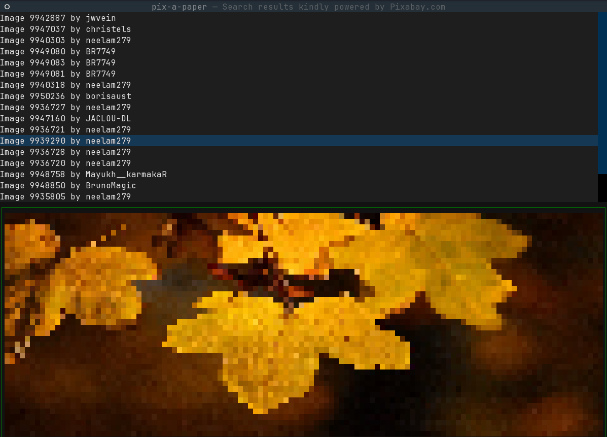

# pix-a-paper

A terminal-based wallpaper browser and setter using images from Pixabay.



## Installation

```bash
uv sync
```

## Usage

Set your Pixabay API key (or use a `.env` file):

```bash
export PIXABAY_API_KEY=your_api_key_here
```

Run the application:

```bash
uv run pix-a-paper
```

Navigate images with arrow keys and press Enter to set as wallpaper.
Quit the application by pressing `q`.

## Requirements

- Python >=3.14
- Pixabay API key (get one at https://pixabay.com/api/docs/)
- [`feh`](https://github.com/derf/feh) for setting wallpapers
